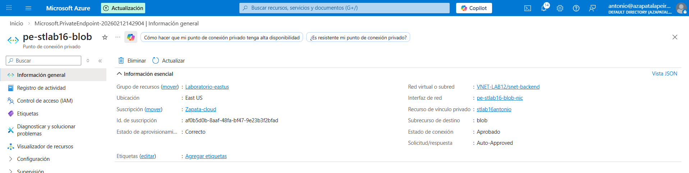
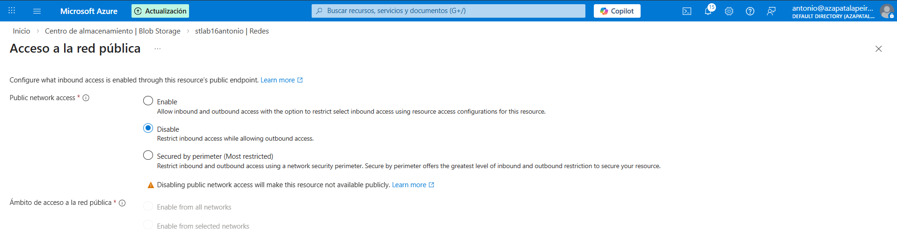
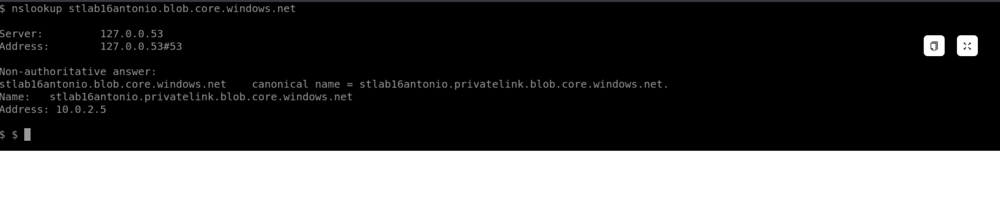

# Lab 16 – Aislamiento de Storage con Private Endpoint (Private Link)

## Objetivo
Configurar un Storage Account en Azure para que no sea accesible desde Internet público y que todo el acceso a los datos se realice exclusivamente a través de la red privada, utilizando Private Endpoint y resolución DNS privada.

El objetivo es simular un escenario real de empresa donde los datos sensibles no deben exponerse públicamente.

---

## Qué he hecho en este laboratorio

1. He creado un Storage Account para pruebas.
2. He desplegado un Private Endpoint (Private Link) para el servicio Blob dentro de la subnet BackEnd.
3. He deshabilitado completamente el acceso por red pública al Storage Account.
4. He configurado la resolución DNS privada para que, desde la VNet, el nombre del Storage resuelva a una IP privada.
5. He validado que el acceso al Storage se realiza por red privada y no por Internet.

---

## Arquitectura y concepto

El Storage Account mantiene su nombre público (`*.blob.core.windows.net`), pero gracias a Private Endpoint:

- El tráfico no sale a Internet.
- El nombre público se resuelve internamente a una IP privada.
- El acceso público queda bloqueado a nivel de red.

Este enfoque reduce la superficie de ataque y es habitual en entornos empresariales donde se manejan datos sensibles.

---

## Configuración utilizada

- VNet: `VNET-LAB12`
- Subnet: `snet-backend`
- Storage Account: `stlab16antonio`
- Servicio protegido: Blob
- Private Endpoint:
  - Nombre: `pe-stlab16-blob`
  - Subrecurso: `blob`
  - IP privada asignada en `snet-backend`
- Acceso público: deshabilitado
- DNS privado:
  - Zona: `privatelink.blob.core.windows.net`
  - Vinculada a la VNet

---

## Validación funcional

Desde una máquina virtual situada en la subnet BackEnd se ha comprobado que el nombre público del Storage se resuelve a una IP privada mediante DNS privado.

Esto confirma que el tráfico hacia el Storage entra por la red privada de Azure y no utiliza Internet público.

---

## Evidencias

### 01 – Private Endpoint aprobado y con IP privada

Se muestra el Private Endpoint asociado a la subnet BackEnd, en estado aprobado y con interfaz de red privada asignada.

---

### 02 – Acceso público deshabilitado

Se muestra el Storage Account con el acceso por red pública completamente deshabilitado.

---

### 03 – Resolución DNS privada desde la red interna

Se muestra cómo el nombre público del Storage (`*.blob.core.windows.net`) resuelve a una IP privada mediante Private DNS.

---

## Checklist de verificación

- [x] El Storage Account no permite acceso desde red pública
- [x] Existe un Private Endpoint asociado al servicio Blob
- [x] El Private Endpoint tiene IP privada en la subnet BackEnd
- [x] El nombre del Storage resuelve a una IP privada desde la VNet

---

## Qué le diría a un cliente o en entrevista

“Con Private Endpoints el Storage deja de estar expuesto a Internet. Aunque se siga utilizando el nombre público del servicio, el tráfico se enruta por la red privada gracias a Private Link y DNS privado, reduciendo claramente la superficie de ataque y mejorando la seguridad de los datos.”
